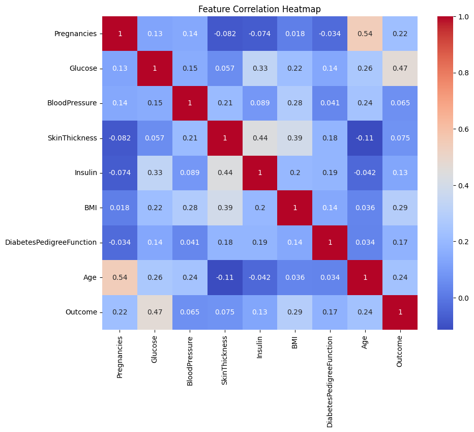
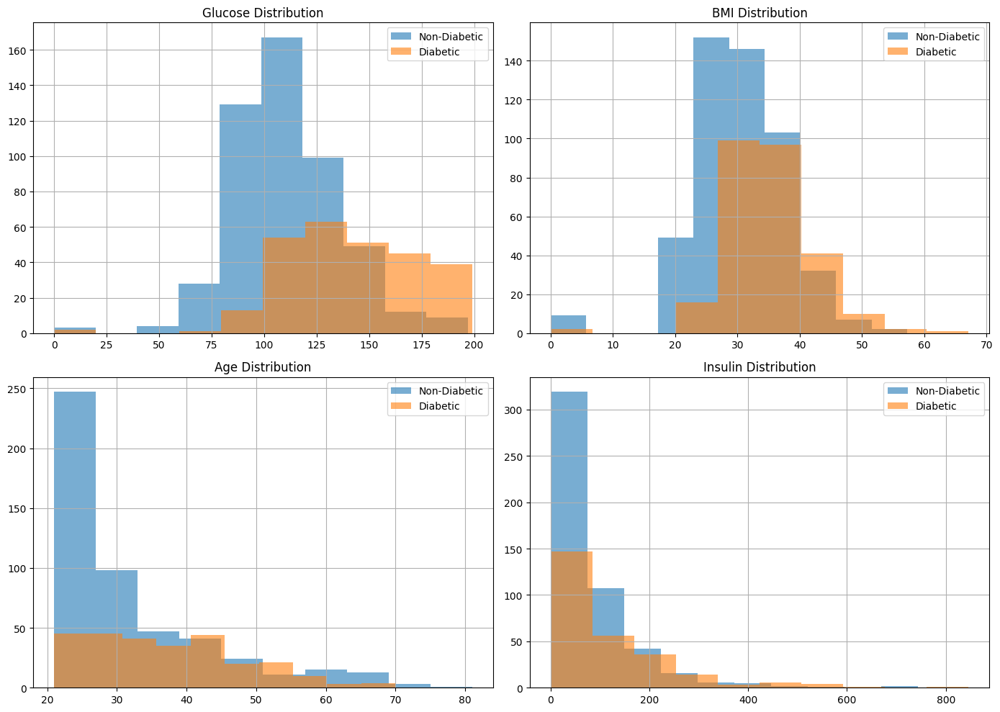

# Mission Statement
The mission of this project is to develop an intelligent, accessible, and accurate machine learning model that predicts the likelihood of diabetes in individuals based on common medical attributes. By leveraging real-world health data and statistical insights, the project aims to support early detection and proactive intervention, ultimately improving patient outcomes and reducing the burden on healthcare systems.

---

# Use Case Overview
This project focuses on early prediction of diabetes in patients based on diagnostic measurements. The model aids healthcare professionals in identifying high-risk individuals using structured health data — a real-world, domain-specific use case, not a generic ML demo.

---

# Dataset Details

**Source**:  
Pima Indians Diabetes Database  
Available via Kaggle: [Kaggle Dataset](https://www.kaggle.com/datasets/uciml/pima-indians-diabetes-database)
Approved by Marvin Muyonga Ogore

**Description**:  
The dataset contains **768 records** of female patients aged **21 or older**.  
Each record includes **8 input variables** and a **binary target** (`1 = diabetic`, `0 = non-diabetic`).

**Features**:
- Pregnancies
- Glucose
- BloodPressure
- SkinThickness
- Insulin
- BMI
- Diabetes Pedigree Function
- Age

**Why this dataset?**
- **Volume**: 768 samples are sufficient for basic model development and validation.
- **Variety**: Covers a range of physiological, demographic, and hereditary indicators — ideal for statistical analysis and ML modeling.

---

# Visualizations That Guided the Model

### Correlation Heatmap

This visualization reveals a high correlation between **Glucose** and the **diabetes outcome** — a key insight for feature prioritization.

---

### Feature Distributions

These histograms illustrate **class imbalances** and distinct separations in **Glucose** and **BMI**, supporting their importance in prediction.

---
